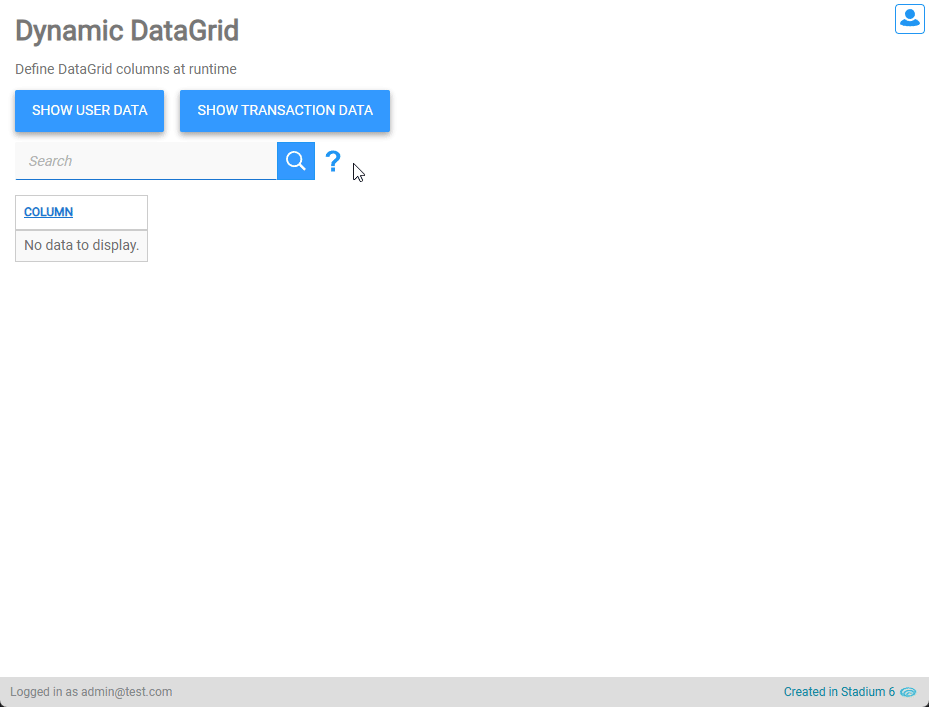
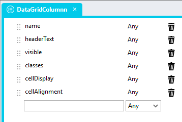
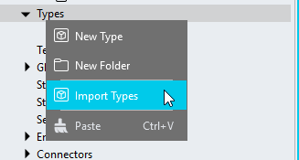
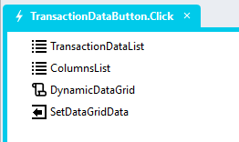

# Dynamic DataGrids

Sometimes you may not know what columns a DataGrid will have at design time. This repo allows for the definition of DataGrid columns at runtime. 



# Version 
1.1 Made most properties optional; improved and modernised the script

## Application Setup
1. Check the *Enable Style Sheet* checkbox in the application properties

## Global Script Setup
1. Create a Global Script called "DynamicDataGrid"
2. Add the input parameters below to the Global Script
   1. Columns
   2. DataGridClass
3. Drag a JavaScript action into the script
4. Add the Javascript below unchanged into the JavaScript code property
```javascript
/* Stadium Script v1.1 https://github.com/stadium-software/dynamic-datagrid */
const obClassName = ~.Parameters.Input.DataGridClass;
let columns = ~.Parameters.Input.Columns || [];
let scope = this;
if (!obClassName) {
    console.error("DataGridClass parameter is required");
    return false;
}
const dg = document.querySelector(`.${obClassName}`);
if (!dg) {
    console.error(`A DataGrid with the class '${obClassName}' was not found`);
    return false;
}
columns.forEach(v => {if (v.visible !== false) v.visible = true;});
const getObjectName = (obj) => {
    let objname = obj.id.replace("-container", "");
    while (objname.includes("_") && !scope[`${objname}Classes`]) {
        const [, rest] = objname.split(/_(.+)/);
        objname = rest;
    }
    return objname;
};
const setDMValues = (ob, property, value) => {
    const obname = getObjectName(ob);
    scope[`${obname}${property}`] = value;
};
setDMValues(dg, "ColumnDefinitions", columns);
```

## Type Setup
The module requires a type called "DataGridColumnn"

## Type Setup
The type can create one nested type manually or use the import option to generate the type in two parts. How the type is used remains the same



### Type Import
1. Right-click on the `Types` node in the `Application Explorer`



2. In the `Import Type` popup
    1. Add "DataGridColumn" into the `Name` input field
    2. Copy & paste the JSON below into the main input area

```json
{
    "name": "",
    "headerText": "",
    "visible": "",
    "cellAlignment": "",
    "cellDisplay": "",
    "classes": ""
}
```

### Manual Type Creation
1. Create a new type called "Columnn"
2. Add the following properties to the type
   1. name (any)
   2. headerText (any)
   3. visible (any)
   4. classes (any)
   5. cellDisplay (any)
   6. cellAlignment (any)

## Page Setup
1. Drag a *DataGrid* Control to the page
2. Add a unique classname of your choice to the *DataGrid* classes property (e.g. dynamic-datagrid)

## Event Handler Setup
1. Drag a *List* to any event handler script and call it "ColumnsList"
2. Set the *List* type to "DataGridColumnn"
3. Populate the List with the columns for your *DataGrid* (you can use any data source for obtain the column names)
   1. name: The column name. The name must match the name of the data field you are planning to display. The name is case sensitive. 
   2. headerText (optional): The heading of the column
   3. visible (optional, defaults to true): a boolean that defines if the column is displayed or not
   4. cellAlignment (optional): left (default), center or right
   5. cellDisplay (optional): default (default), wrap or ellipsis
   6. classes (optional): any classes you want to attach to the column
4. Drag the "DynamicDataGrid" script into the event handler
5. Provide values for the script input parameters
   1. Enter the unique classname you assigned to the *DataGrid* above in the "DataGridClass" input parameter (e.g. dynamic-datagrid)
   2. Select the "ColumnsList" in the Columns input parameter
6. Populate the *DataGrid* with data that matches the list of columns you defined



**Columns List Example**
```json
[
    {
        "name": "CategoryName",
        "visible": false
    },{
        "name": "ProductName",
        "headerText": "Product Name",
        "cellDisplay": "ellipsis"
    },{
        "name": "ProductSales",
        "headerText": "Product Sales",
        "cellAlignment": "right",
        "classes":"lightblue"
    }
]
```